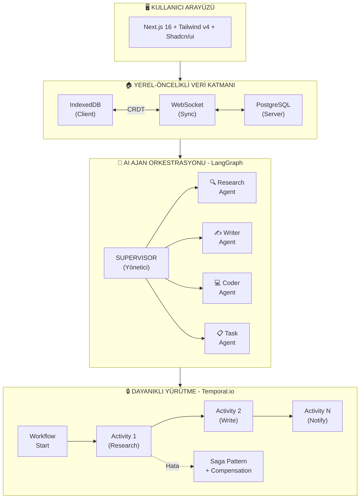
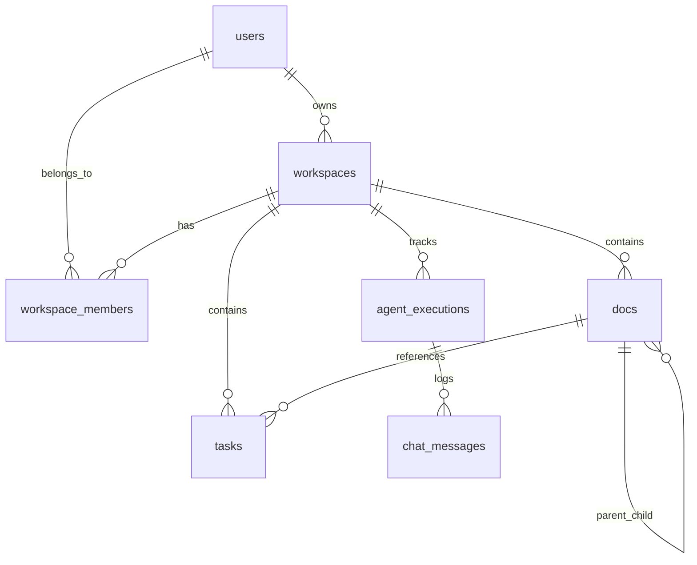

# 🌟 Nexus

> **Yerel-Öncelikli, Otonom Çoklu-Ajan Orkestrasyonu ve İşbirliği Platformu**

[](https://nextjs.org/)
[](https://www.typescriptlang.org/)
[](docs/adr/001-local-first-architecture.md)
[](https://langchain-ai.github.io/langgraph/)
[](https://temporal.io/)

---

## 📋 Proje Özeti

**Nexus**, modern yazılım mimarisinin üç temel paradigmasını birleştiren bir tam yığın (Full Stack) portföy projesidir:

1. **🏠 Yerel-Öncelikli Mimari (Local-First)** - Zero Sync ile 0ms gecikme, çevrimdışı çalışma
2. **🤖 Ajanik Yapay Zeka (Multi-Agent AI)** - LangGraph ile otonom ajan orkestrasyonu
3. **🔒 Dayanıklı Yürütme (Durable Execution)** - Temporal.io ile hata toleransı

Bu proje, bir mezun adayın "kod yazabildiğini" değil, **"sistem tasarlayabildiğini"** kanıtlamak için tasarlanmıştır.

---

## 🏗️ Mimari Genel Bakış



> ⚠️ **Not:** Local-First senkronizasyonu için **custom Zero Sync Engine** implementasyonu kullanılmaktadır.
> Bu implementasyon, Zero/Rocicorp konseptlerinden esinlenmiş olup, resmi `@rocicorp/zero` SDK'sı değildir.
> IndexedDB + REST API tabanlı optimistic updates ve offline-first pattern'ları içerir.

---

## 🛠️ Teknoloji Yığını

| Katman                   | Teknoloji               | Seçim Gerekçesi                             |
| ------------------------ | ----------------------- | ------------------------------------------- |
| **Frontend**             | Next.js 16 (App Router) | RSC, Server Actions, Vercel AI SDK uyumu    |
| **Styling**              | Tailwind v4 + Shadcn/ui | Modern tasarım sistemi, tam özelleştirme    |
| **Veri Senkronizasyonu** | Zero Sync               | 0ms gecikme, offline-first, CRDT            |
| **Veritabanı**           | PostgreSQL + pgvector   | İlişkisel veri + vektör arama (RAG)         |
| **AI Orkestrasyonu**     | LangGraph               | Çoklu ajan, döngüsel akışlar, state machine |
| **İş Akışı Motoru**      | Temporal.io             | Saga pattern, hata toleransı, durability    |
| **Monorepo**             | Turborepo + pnpm        | Hızlı build, workspace yönetimi             |

---

## 📁 Proje Yapısı

```
nexus/
├── apps/
│   └── web/                    # Next.js 16 uygulaması
│       ├── src/
│       │   ├── app/            # App Router sayfaları
│       │   ├── components/     # React bileşenleri
│       │   ├── hooks/          # Custom hooks (Zero queries)
│       │   └── lib/            # Utilities, Zero client
│       └── package.json
│
├── packages/
│   ├── database/               # Drizzle ORM şeması
│   │   └── src/schema/         # PostgreSQL tabloları
│   ├── zero-schema/            # Zero Sync şeması
│   │   └── src/                # Tablolar, ilişkiler, izinler
│   └── typescript-config/      # Paylaşılan TS config
│
├── turbo.json                  # Turborepo yapılandırması
├── pnpm-workspace.yaml         # Workspace tanımı
└── package.json                # Root package
```

---

## ✨ Özellikler

### 🏠 Local-First (Yerel-Öncelikli)
- **Çevrimdışı Çalışma**: İnternet olmadan tam fonksiyonellik
- **0ms Gecikme**: Tüm işlemler önce yerel veritabanında
- **Otomatik Senkronizasyon**: Bağlantı geldiğinde otomatik sync
- **CRDT Çakışma Çözümü**: Aynı anda düzenleme desteği

### 🤖 Multi-Agent AI
- **Supervisor Pattern**: Merkezi ajan koordinasyonu
- **Uzman Ajanlar**: Researcher, Writer, Coder, Project Manager
- **Human-in-the-Loop**: Kritik işlemlerde insan onayı
- **RAG Entegrasyonu**: Döküman ve web araması

### 📄 Döküman Yönetimi
- **Rich Text Editor**: BlockNote entegrasyonu
- **Gerçek Zamanlı İşbirliği**: CRDT ile çakışmasız düzenleme
- **AI Destekli Yazım**: Ajan tarafından içerik oluşturma
- **Hiyerarşik Yapı**: Alt döküman desteği

### ✅ Görev Yönetimi
- **Kanban Board**: Sürükle-bırak görev yönetimi
- **AI Görev Atama**: Ajanlar otomatik görev oluşturabilir
- **Öncelik Sistemi**: Low, Medium, High, Urgent
- **Due Date Tracking**: Tarih takibi

---

## 🚀 Kurulum

### Gereksinimler
- Node.js 20+
- pnpm 10+
- PostgreSQL 15+ (pgvector extension)
- Docker (Temporal için)

### Adımlar

```bash
# 1. Repository'yi klonla
git clone https://github.com/username/nexus.git
cd nexus

# 2. Bağımlılıkları yükle
pnpm install

# 3. Environment variables
cp .env.example .env.local
# DATABASE_URL, OPENAI_API_KEY, vb. ayarla

# 4. Veritabanı migration
pnpm --filter @nexus/database db:push

# 5. Geliştirme sunucusunu başlat
pnpm dev
```

---

## 🎯 Mimari Kararlar (ADR)

### Neden Custom Local-First Sync (REST API yerine)?
- **Problem**: Geleneksel API'ler ağ gecikmesi yaratır, offline çalışmıyor
- **Çözüm**: Zero Sync konseptinden esinlenen custom senkronizasyon motoru
- **Implementasyon**: IndexedDB + REST API + Optimistic Updates
- **Trade-off**: Resmi Zero SDK yerine custom implementasyon (daha fazla kontrol, ama daha fazla bakım)
- **Detay**: [ADR-001: Local-First Architecture](docs/adr/001-local-first-architecture.md)

### Neden LangGraph (tek LLM çağrısı yerine)?
- **Problem**: Karmaşık görevler tek bir LLM ile çözülemez
- **Çözüm**: Uzman ajanların orkestrasyonu (Supervisor Pattern)
- **Trade-off**: Daha yüksek maliyet, ancak daha kaliteli çıktı
- **Detay**: [ADR-002: Multi-Agent LangGraph](docs/adr/002-multi-agent-langgraph.md)

### Neden Temporal (basit queue yerine)?
- **Problem**: Uzun süreli işlemler sunucu çökmelerinde kaybolur
- **Çözüm**: Temporal durumu kalıcı olarak saklar (Durable Execution)
- **Trade-off**: Ek altyapı, ancak garantili yürütme
- **Detay**: [ADR-003: Durable Execution](docs/adr/003-durable-execution-temporal.md)

---

## 📊 Veritabanı Şeması



---

## 🔮 Uygulanan Özellikler

- [x] **Yjs Real-time Collaboration** - WebSocket tabanlı eş zamanlı döküman düzenleme
- [x] **OpenTelemetry Tracing** - Jaeger ile dağıtık izlenebilirlik
- [x] **Temporal Workflows** - Dayanıklı iş akışları ve worker'lar
- [x] **Corrective RAG (CRAG)** - Öz-düzeltici retrieval mekanizması
- [x] **Zero Sync Client** - Optimistic updates ve offline-first hooks
- [x] **Tavily Web Search** - AI-optimized web araştırması
- [x] **Multi-Agent System** - Supervisor, Research, Writer, Coder ajanları

## 🚀 Hızlı Başlangıç

```bash
# Bağımlılıkları yükle
pnpm install

# Veritabanını başlat
docker compose up -d postgres

# Geliştirme sunucusunu başlat
pnpm dev

# Collaboration sunucusunu başlat (opsiyonel)
cd apps/web && pnpm collab

# Jaeger izleme sunucusunu başlat (opsiyonel)
docker compose up -d jaeger
# http://localhost:16686 adresinden trace'leri görüntüle
```

---

## 📝 Lisans

MIT License - Bu proje bir portföy projesidir.

---

## 👤 Geliştirici

Bu proje, modern yazılım mimarisi paradigmalarını (Local-First, Agentic AI, Durable Execution) tek bir projede birleştirerek, 2026 standartlarında bir tam yığın mühendislik yetkinliği sergilemek amacıyla geliştirilmiştir.

**Anahtar Yetkinlikler:**
- Dağıtık Sistemler (Distributed Systems)
- Çoklu Ajan AI Sistemleri (Multi-Agent AI)
- Yerel-Öncelikli Mimariler (Local-First)
- Dayanıklı Yürütme (Durable Execution)
- Modern TypeScript/React Ekosistemi
